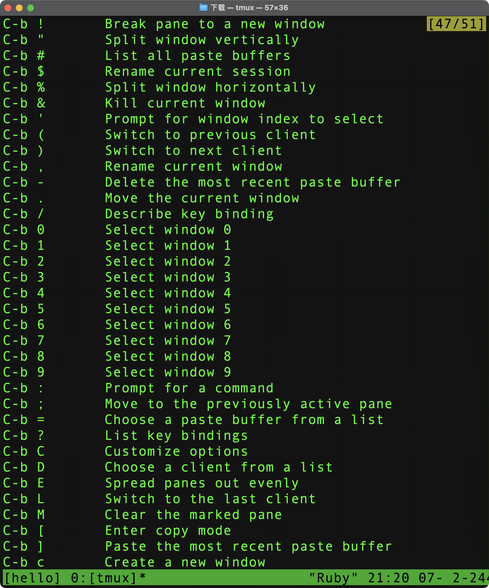

## 前言

虽然有了homelab，不过有些时候还是需要云工具解决的，比如，在cf上的workers用于处理openai的转发，比如需要在线上传一些东西呀，等等这里备忘记录一下。

## rclone工具与R2云存储

众所周知，cloudflare真是个神仙网站，利用R2建立好存储桶，可以很容易的把内容存储起来，可以作为一个非常好的文件中转站。虽然目前找到了利用cos+zfile+homelab+cf_tunnel的组合来获得自己的私有专属网盘，这个组合可以使用网页上传文件，然后生成链接，方便目标客户端下载，解决了非常多的问题。

不过有个非常重要的需求一直没有解决。就是远程备份。或者说，如何仅仅使用命令行就服务器上的文件上传到云存储上（目前仅仅能完成下载）。另一方面，我现在使用的cyberduck,FE file explorer pro，感觉是用来使用去还是应该考虑尝试命令行工具。（当然cyberduck也是一直没有配置好r2）。

刚好借这次机会配置一下，首先创建好r2上的存储桶，然后设置域名，保证文件可以外部访问。其实至此，一个可以上传小文件（300MB以下）的服务器已经完成了，当然，cloudflare的界面不能说很好用。

### 安装和配置rclone

就安装来说，还是比较简单的。

``` bash
brew install rclone #mac
sudo apt install rclone #ubuntu
sudo dnf install rclone #rocky
```

配置起来可以参考[官方教程](https://developers.cloudflare.com/r2/examples/rclone/)。理解了原理，是非常好配置的。

``` bash
[r2]
type = s3
provider = Cloudflare
access_key_id = <access_key_id>
secret_access_key = <secret_access_key>
endpoint = https://<endpoint_string>.r2.cloudflarestorage.com
acl = private
```

``` bash
rclone copy file.png r2:bucket_name
```

rclone非常好用，特别是可以上传文件夹以及删除服务器文件夹。不过也有小问题，r2如果配置一个指定bucket的token基本上什么也做不了，不知道这个bug怎么解决。也许，cloudflare就是这样的功能吧，如果需要隔离也许应该注册个小号。

cyberduck配置就比较奇葩了，在配置r2的时候，有几个注意点：

1. 输入endpoint地址的时候一定不要把"https://"头带上，它会“友好”的给把协议改掉，这会造成添加失败；
2. 账号的token也要是具有最高管理权限，另外，endpoint只能是根目录；
3. cyberduck在使用的时候有三个标签“当前连接”，“书签库”，“历史连接”，配置好连接后，在当前连接页面添加可以把当前连接添加到书签中了;(添加甚至需要快捷键，或者右键菜单)
4. cyberduck很多连接方式，输入的方式也是非常古怪，很多地址细节尽量使用粘贴的方式完成；
5. 如此复杂的ui结果每次只能访问一个数据源，不能数据源间同步，cyberduck确实挺奇怪的。

以上最让我在意的其实是cyberduck的ui逻辑，有种匪夷所思的感觉，以至于我用了很久cyberduck才搞明白。（感觉快成了cyberduck吐槽了）

## 阿里云盘

考虑到很多视频资料的下载，其实阿里云盘也是很棒的中专资源，可惜群晖的套件里不支持阿里云盘的直接同步，虽然查到相关教程可以使用rclone映射，不过考虑到nas闲着也是闲着，准备部署一个alist把阿里云映射为webdav。

``` yml
version: '3.3'
services:
    alist:
        image: 'xhofe/alist:latest'
        container_name: alist
        volumes:
            - '/etc/alist:/opt/alist/data'
        ports:
            - '5244:5244'
        environment:
            - PUID=0
            - PGID=0
            - UMASK=022
        restart: unless-stopped
```

很容易就可以启动一个服务，然后用`sudo docker logs <container-id>`获取用户名密码，配置好存储源就可以访问了～
使用<http://id:port/dav>和用户名密码就可以访问webdav服务了！真的是非常方便啊。

## 学习tmux

多终端操作的机会感觉非常多啊，看来还是应该好好学习一下终端使用，nohup太原始了，虽然可以学习screen，不过既然要学了，不如学新的，这样我就找到了tmux。

``` bash
tmux new -s hello
sessions should be nested with care, unset $TMUX to force
```

简单上手就出问题了,果然要理解他的理念模型。真的使用起来之后其实就是简单的几条命令就可以完成，[教程](https://blog.csdn.net/NSJim/article/details/127754413)也非常多。

``` bash
tmux kill-server # 杀死所有进程
tmux ls # 列出一个进程
tmux new -s session_name #新建会话
tmux a -t session_name #进入会话 attach
tmux detach #分离会话，也就是让会话进入后台
ctrl b d #上一命令快捷键（毕竟有时候进程在运行）
exit #显式的杀死进程
```

也许最需要记忆的快捷键是`C-b ?`，这样可以看到帮助菜单。



原始的帮助文档非常有帮助，比如`C-b s`这个命令，很多中文文档写的是列出会话，感觉是`tmux ls`的快捷键，可是按照应用内置的文档效果是“Choose a session from a list”，实际使用的效果来看，应用的帮助更加贴切。当然也有不方便的地方，对于mac而言，触控板的操作变成了“上下”，无法滚动浏览信息了。更加复杂的设置也有[参考帮助](https://www.jianshu.com/p/fd3bbdba9dc9),不过这里感觉可以点到为止，tmux暂时可以作为后台运行的工具就好了，更多的设置未来用到可以再考虑。当然，对于滚动的问题，也许我应该更加熟悉一下more命令也许更好。


